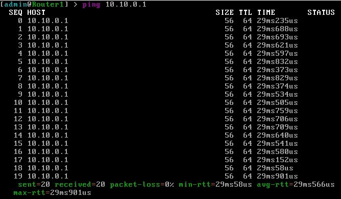
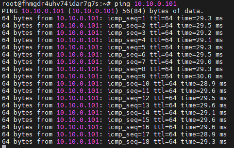

University: [ITMO University](https://itmo.ru/ru/)  
Faculty: [FICT](https://fict.itmo.ru)  
Course: [Network programming](https://github.com/itmo-ict-faculty/network-programming)  
Year: 2022/2023  
Group: K34202  
Author: Demin Nikita Igorevich  
Lab: Lab1  
Date of create: 06.03.2023  
Date of finished:  

Цель работы
Целью данной работы является развертывание виртуальной машины на базе платформы Yandex compute cloud с установленной системой контроля конфигураций Ansible и установка CHR в VirtualBox

Ход работы:
    1) Была создана виртуальная машина на платформе Yandex compute cloud с необходимыми характеристиками.  
      
    2) Было произведено подключени по SSH к виртуальной машине при помощи пары заранее сгенерированных ключей, публичный ключ был занесен на платформу Yandex compute cloud.  
      
      
    3) На виртуальную машину был установлен Ansible и python3.8  
      
    4) В VirtualBox была создана виртуальная машина RouterOS на основе образа, представленного на оффициальном сайте. Для корректной работы виртуальной машины тип подключения в настройках была обозначен как "Сетевой мост". В дальнейшем подключение будет производится по MAC-адресу.  
      
    5) Для организации VPN туннеля было выбрано решение Wireguard. На удаленном сервере была сгенерирована и сохранена пара ключей при помощи утилит, предоставляемых Wireguard-ом.  
      
    6) Была выполнена конфигурация Wireguard-сервера на удаленной машине, обозначен используемый порт, разрешенный адрес пира (RouterOS), значение ключей.  
      
    7) Для конфигурации клиента на RouterOS был использован Winbox. Был сконфигурирован интерфейс wireguard1.  
      
    8) В список пиров для Wireguard был добавлен Wireguard-сервер, заполнено значение порта, IP-адрес, публичный ключ сервера.  
      
    9) Были сохранены ip-адреса интерфейсов. На интерфейс wireguard1 был сохранен адрес, ранее записанный для пира на сервере.  
      
    10) Был настроен DHCP-клиент. Это не обязательная настройка для поднятия Wireguard туннеля, но моя локальная сеть использует DHCP-сервер.  
      
      
    После этого Wireguard-сервер начинает видеть подключенный пир, машины пингуются друг другом.  
      
      
Вывод:
    Были созданы виртуальные машины: на облачной платформе и локально. Был создан сервер автоматизации на платформе Yandex compute cloud, настроен VPN-туннель при помощи решения Wireguard, проверена корректная работа элементов. 