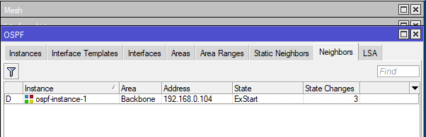

University: [ITMO University](https://itmo.ru/ru/)  
Faculty: [FICT](https://fict.itmo.ru)  
Course: [Network programming](https://github.com/itmo-ict-faculty/network-programming)  
Year: 2022/2023  
Group: K34202  
Author: Demin Nikita Igorevich  
Lab: Lab1  
Date of create: 06.03.2023  
Date of finished:  

Цель работы
С помощью Ansible настроить несколько сетевых устройств и собрать информацию о них. Правильно собрать файл Inventory.  

Ход работы:  
    1) Была создана вторая виртуальная машина RouterOS, при помощи аналогичной первой машине конфигурации новая виртуальная машина так же была настроена на доступ через Wireguard  
    2) На виртуальных машинах RouterOS была настроена возможность подключения по SSH, который использует Ansible  
      
    3) Был создан и заполнен Inventory-файл, в него были включены IP-адреса виртуальных машин RouterOS, с которыми в дальнейшем будет работать Ansible, логин и пароль пользователя, настроен плагин подключения и подключены необходимые модули.  
      
    4) Был создан и выполнен первый playbook.  
      
      
    5) Код первого playbook представлен.  
      
    6) В результате исполнения playbook были созданы пользователи, настроен ntp-клиент и настроен ospf.  
      
      
      
      
    7) Был создан и исполнен playbook по сбору информации.  
      
      
    8) Результаты пингов между машинами:  
      
      
      
      
      
Вывод:
    В данной работе был настроен еще один роутер, при помощи Ansible была собрана информация о роутерах, были получены знания по настройке роутеров при помощи Ansible - был создан пользователь, настроен NTP-клиент и OSPF.  