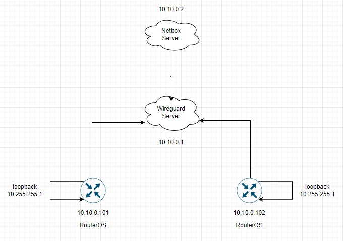

University: [ITMO University](https://itmo.ru/ru/)  
Faculty: [FICT](https://fict.itmo.ru)  
Course: [Network programming](https://github.com/itmo-ict-faculty/network-programming)  
Year: 2022/2023  
Group: K34202  
Author: Demin Nikita Igorevich  
Lab: Lab1  
Date of create: 06.03.2023  
Date of finished:  

Цель работы  
С помощью Ansible и Netbox собрать всю возможную информацию об устройствах и сохранить их в отдельном файле.  

Ход работы:  
    1) Была создана еще одна виртуальная машина на платформе Yandex compute cloud для поднятия на ней Netbox. На машине был установлен и настроен Wireguard.
      
      
    2) На новой виртуальной машине был установлен Netbox, в виртуальном окружении установлены и обновлены все библиотеки для python, которые используются в Netbox, была установлена база данных PostgreSQL для хранения данных от Netbox, а так же был изменен конфигурационный файл. Веб-приложение, представленное Django, было запущено и работало корректно.  
      
      
    3) Был создан playbook для сбора информации из NetBox и сохранения информации в файл.  
      
    4) Был создан playbook для конфигурации RouterOS на основе полученной из Netbox информации (название и IP-адрес).  
      
      
      
    5) Был создан playbook для получения информации о серийном номере RouterOS и сохранения данного номера в Netbox. После выполнения playbook данные были изменены.  
      
      
      
      
      
      
      
      
      
      
Вывод:  
    Был установлен и поднят сервер Netbox и все небходимые для него сервисы и инструменты на новой виртуальной машине, были получены навыки работы с Netbox, умение взаимодействовать с сервером Netbox при помощи Ansible  