University: [ITMO University](https://itmo.ru/ru/)  
Faculty: [FICT](https://fict.itmo.ru)  
Course: [Network programming](https://github.com/itmo-ict-faculty/network-programming)  
Year: 2022/2023  
Group: K34202  
Author: Demin Nikita Igorevich  
Lab: Lab1  
Date of create: 06.03.2023  
Date of finished:  

Цель работы  
Изучить синтаксис языка программирования P4 и выполнить 2 задания обучающих задания от Open network foundation для ознакомления на практике с P4.  

Ход работы:  
    1) По руководству в github.com был склонирован репозиторий, а так же установлен Vagrant.  
    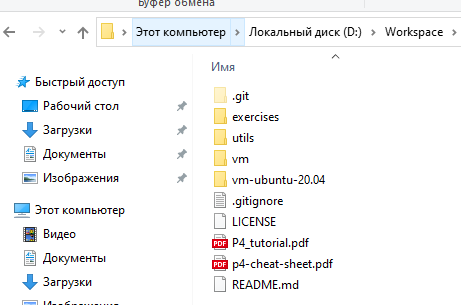  
    2) После установки Vagrant был запущен в папке vm-ubuntu-20.04 склонированного репозитория  
    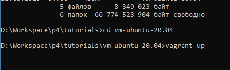  
    3) После входа с credentionals p4/p4 при помощи make был скомпилирован неполный вариант программы на p4, после чего был выполнен тест сети.  
    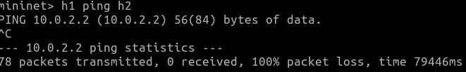  
    4) В задании на github отмечены все элементы кода, требующие доработок. Первый из них - парсер для полей ethernet_t и ipv4_t  
    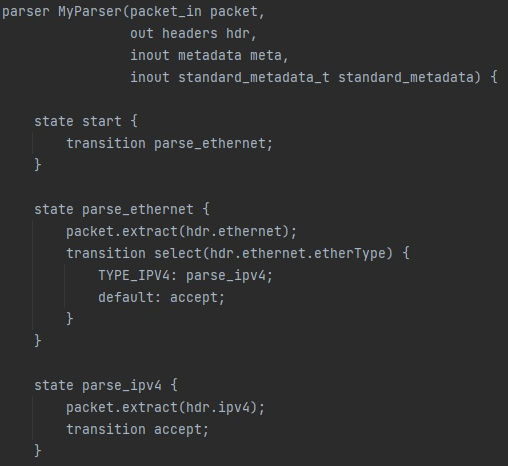  
    5) Далее был выполнен элемент, меняющий порты, обновляющий адрес получателя и уменьшающий счетчик времени жизни пакета.  
    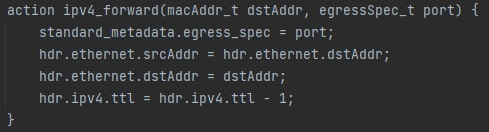  
    6) Далее был выполнен сборщик пакета, определяющий порядок сохранения полей при сборке пакета.  
    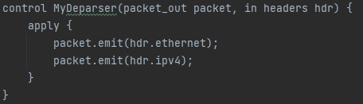  
    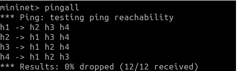  
    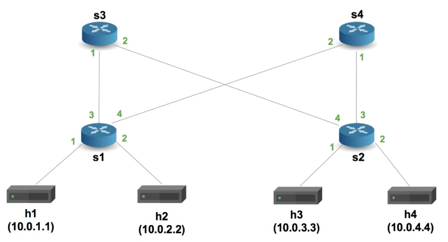  
    7) Описание следующего задания так же содержит элементы кода, требующие доработок. Была выполнена обработка заголовков myTunnel и ipv4.  
    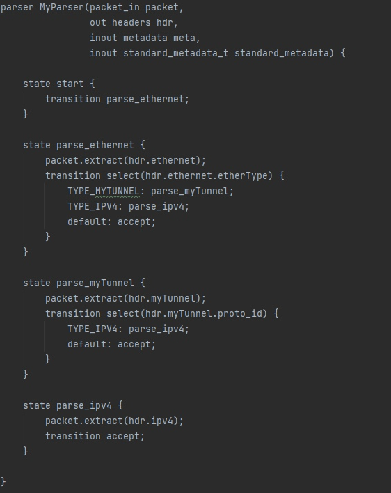  
    8) Была добавлена функция, устанавливающая следующий порт, таблица для тунеля, и вызов соответствующей функции в зависимости от корректности заголовка myTunnel иди ipv4.  
    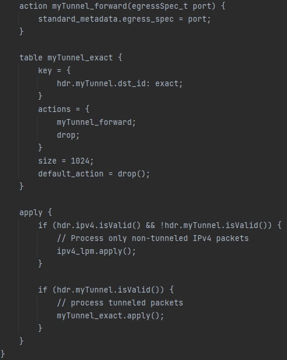  
    9) Далее был выполнен сборщик пакета, определяющий порядок сохранения полей при сборке пакета.  
    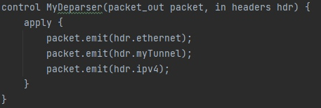  
    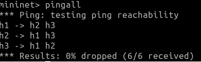  
    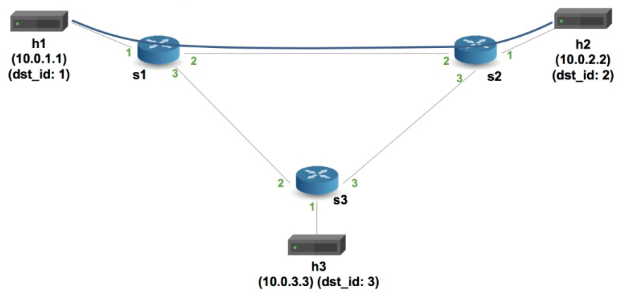  
Вывод:  
    Был изучен синтаксис языка P4 и были выполнены 2 обучающих задания в соответствующем репозитории при помощи Vagrant  